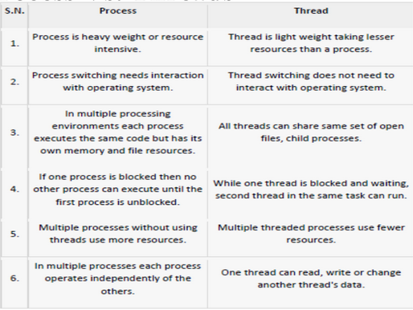
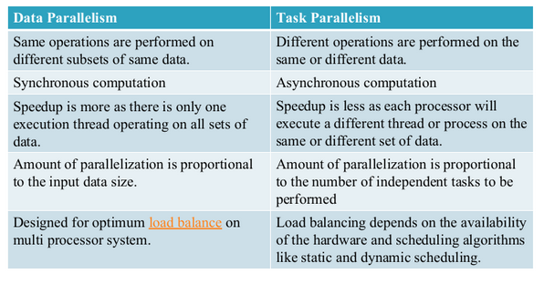

### 1. Threads

**Formal Definition:** A thread is the smallest sequence of programmed instructions that can be managed independently by a scheduler, which is typically a part of the operating system.

A thread is a basic unit of CPU utilization; it comprises a thread ID, a program
counter (PC), a register set, and a stack. It shares with other threads belonging
to the same process its code section, data section, and other operating-system
resources, such as open files and signals. A traditional process has a single
thread of control. If a process has multiple threads of control, it can perform
more than one task at a time. 

**Intuitive Explanation:**
Think of a process as a factory. The factory has a building, blueprints, and materials (this represents the process's shared memory, code, and data). A thread is a worker inside that factory. 
* **Single-threaded process:** One worker in the factory doing tasks sequentially.
* **Multi-threaded process:** Multiple workers in the same factory. They share the same tools and materials (code, data, open files) but have their own specific instructions and workspaces (Thread ID, Program Counter, Registers, Stack).

This sharing makes switching between threads much faster and less resource-intensive than switching between entirely different processes.

---

### 2. Multicore Programming Challenges

**Formal Definition:** The practice of writing code to execute simultaneously across multiple processing units (cores) within a single computing component.

**Intuitive Explanation:**
Having multiple workers (cores) is only efficient if you can organize them effectively. The challenges are managerial:
* **Dividing Activities:** Breaking a monolithic task into independent sub-tasks.
* **Balance:** Ensuring all cores have equal amounts of work. If Core 1 finishes in 1 second and Core 2 takes 10 seconds, Core 1 sits idle.
* **Data Splitting:** Distributing the data evenly so each core has data to process.
* **Data Dependency:** Managing situations where Core B needs the output of Core A before it can begin its task.
* **Testing and Debugging:** Tracking down errors is exponentially harder when multiple execution paths occur simultaneously and unpredictably.

---

### 3. Concurrency vs. Parallelism

**Formal Definitions:**
* **Concurrency:** A system's ability to manage multiple tasks making progress over the same period. 
* **Parallelism:** A system's ability to execute multiple tasks simultaneously at the exact same instant.

**Intuitive Explanation:**
* **Concurrency:** You are cooking dinner. You chop onions, put them in a pan, and while they fry, you chop tomatoes. You are only doing *one* physical task at any exact second, but you are making progress on multiple tasks (chopping, frying) within the same timeframe by switching between them rapidly. This can happen on a single CPU core via an OS scheduler.
* **Parallelism:** You are chopping onions while another person simultaneously chops tomatoes. Two separate tasks are executing at the exact same physical instant. This requires multiple CPU cores.

**Types of Parallelism:**
* **Data Parallelism:** Multiple cores perform the *same* operation on *different* pieces of data. focus on distributing data across different parallel nodes/cores(e.g., Core 1 brightens the top half of an image; Core 2 brightens the bottom half).
* **Task Parallelism:** Multiple cores perform *different* operations on the same or different data. focus on distributing execution processes across different parallel nodes/cores(e.g., Core 1 loads image data from disk; Core 2 processes audio).

---

### 4. Amdahl's Law

**Formal Definition:** A formula used to find the maximum expected improvement to an overall system when only a part of the system is improved.

**Intuitive Explanation:**
No matter how many cores you add, the speed of your program is limited by the part of the code that *must* be executed sequentially (one step at a time). 

If $S$ is the serial (sequential) portion of the work, and $N$ is the number of processing cores, the theoretical speedup is calculated as:

$$Speedup = \frac{1}{S + \frac{1-S}{N}}$$

As the number of cores ($N$) approaches infinity, the term $\frac{1-S}{N}$ approaches $0$, leaving the absolute maximum limit of speedup as:

$$Max\ Speedup = \frac{1}{S}$$

**Scenario Breakdown:**
If an application is 75% parallel and 25% serial ($S = 0.25$):
* Moving from 1 to 2 cores: $\frac{1}{0.25 + \frac{0.75}{2}} = \frac{1}{0.25 + 0.375} = \frac{1}{0.625} = 1.6 \text{ times faster.}$
* Infinite cores limit: $\frac{1}{0.25} = 4 \text{ times faster.}$ 
No matter the hardware, this specific application can never run more than 4 times faster than its single-core baseline.

1. Parallelizing a Program:
   - Scenario: A program spends 80% of its time in parallelizable code and 20% in serial code.
   - Amdahl's Law: Even with infinite parallel resources, speedup is limited to 1 / 0.2 = 5x. Serial portion caps performance.

2. Database Query Optimization:
   - Scenario: 90% of a query can be parallelized, but 10% remains sequential (e.g., final aggregation).
   - Amdahl's Law: Maximum speedup is 1 / 0.1 = 10x. No matter how many cores, 10x is the limit.

3. Video Rendering:
   - Scenario: 95% of rendering is parallel, but 5% is sequential (e.g., final frame composition).
   - Amdahl's Law: Speedup cannot exceed 1 / 0.05 = 20x. Serial bottleneck limits gains.

---

### 5. User Threads vs. Kernel Threads

**Formal Definitions:**
* **User Threads:** Threads implemented by a user-level library; the operating system kernel is completely unaware of them.
* **Kernel Threads:** Threads supported and managed directly by the operating system kernel.

| Feature | User-Level Threads | Kernel-Level Threads |
| :--- | :--- | :--- |
| **Management** | Handled by user-space libraries (e.g., POSIX Pthreads). | Handled directly by the OS kernel (Windows, Linux, macOS). |
| **Speed** | Fast. Creating and switching threads requires no system calls. | Slower. Requires OS intervention and system calls for context switching. |
| **Blocking** | If one thread executes a blocking system call (e.g., waiting for I/O), the OS blocks the entire process, halting all user threads. | If one thread blocks, the kernel can schedule another thread from the same process to run. |
| **Hardware** | Cannot inherently take advantage of multicore parallel processing. | Fully capable of true parallelism across multiple CPU cores. |

---

### 6. Multithreading Models

**Formal Definition:** The architecture dictating how user-level threads are mapped to underlying kernel-level threads for execution.

**Intuitive Explanation:**
Since the OS only schedules kernel threads onto hardware cores, user threads must be linked to kernel threads to actually run. 

* **Many-to-One Model:**
    * **Mapping:** Many user threads map to a single kernel thread.
    * **Mechanics:** The user library swaps user threads in and out of the single kernel thread.
    * **Drawback:** If one user thread makes a network request and waits, the kernel thread is blocked. The entire application freezes. It cannot utilize multicore systems.
    * **Usage:** Rare today; used in early systems before OS-level threading was mature.

* **One-to-One Model:**
    * **Mapping:** Every individual user thread maps to its own dedicated kernel thread.
    * **Mechanics:** True hardware parallelism. If one thread blocks, others continue.
    * **Drawback:** Creating a user thread requires creating a kernel thread, adding overhead. OS limits the maximum number of threads so system resources aren't exhausted.
    * **Usage:** The standard model for modern general-purpose operating systems (Linux, Windows).

* **Many-to-Many Model:**
    * **Mapping:** Many user threads are multiplexed onto a smaller or equal number of kernel threads.
    * **Mechanics:** The OS creates a pool of kernel threads. The user library dynamically maps user threads to available kernel threads.
    * **Advantage:** Prevents the system from being overwhelmed by too many kernel threads, while still providing true parallelism and preventing a single block from freezing the application.
    * **Usage:** Highly efficient but complex to engineer. Used in specific specialized environments (e.g., Windows ThreadFiber).

### 1. Are "user-level threads" and "user threads" the same thing?

**Yes.** The terms are completely interchangeable. They both refer to threads that are managed entirely by a library in the application's user space, without the operating system kernel knowing they exist.

### 2. Do all user threads need to be mapped to kernel threads? 

**Yes.** The CPU hardware only executes what the operating system kernel schedules. Because the kernel knows nothing about user-level threads, a user thread cannot actually run on a physical CPU core unless it is mapped to a kernel thread. The kernel thread acts as the bridge to the hardware.

**Why create a user thread instead of directly using a kernel thread?**
* **Speed and Overhead:** Creating, destroying, and switching between kernel threads requires a "context switch" and system calls. This forces the CPU to switch from user mode to kernel mode, which is computationally expensive and slow. User threads are created and managed by a library entirely in user space. Switching between user threads is as fast as a standard function call.
* **Historical Context:** Early operating systems did not support kernel-level multithreading at all. User threads were invented as a workaround so programmers could have concurrency in their applications even when the OS didn't support it. 

**Do we need a user thread to access a kernel thread?**
For standard application development, **yes**. You write code in user space. When you use a programming language to create a thread (like in Java, Python, or C++), you are using a user-level thread library. That library creates the user thread and automatically negotiates with the operating system to map it to a kernel thread on your behalf. You cannot safely or directly manipulate kernel data structures from a user-level application.

### 3. Is the mapping done by the library or the programmer?

**It is done by the thread library and the operating system.** As a programmer, you simply write the code to create a thread (e.g., `pthread_create()` in C, or `new Thread()` in Java). You do not write the mapping logic. 

The underlying thread library acts as a middleman. Depending on the OS and the library you are using, the library will decide how to map your newly created user threads to the kernel threads (using the Many-to-One, One-to-One, or Many-to-Many models discussed previously).